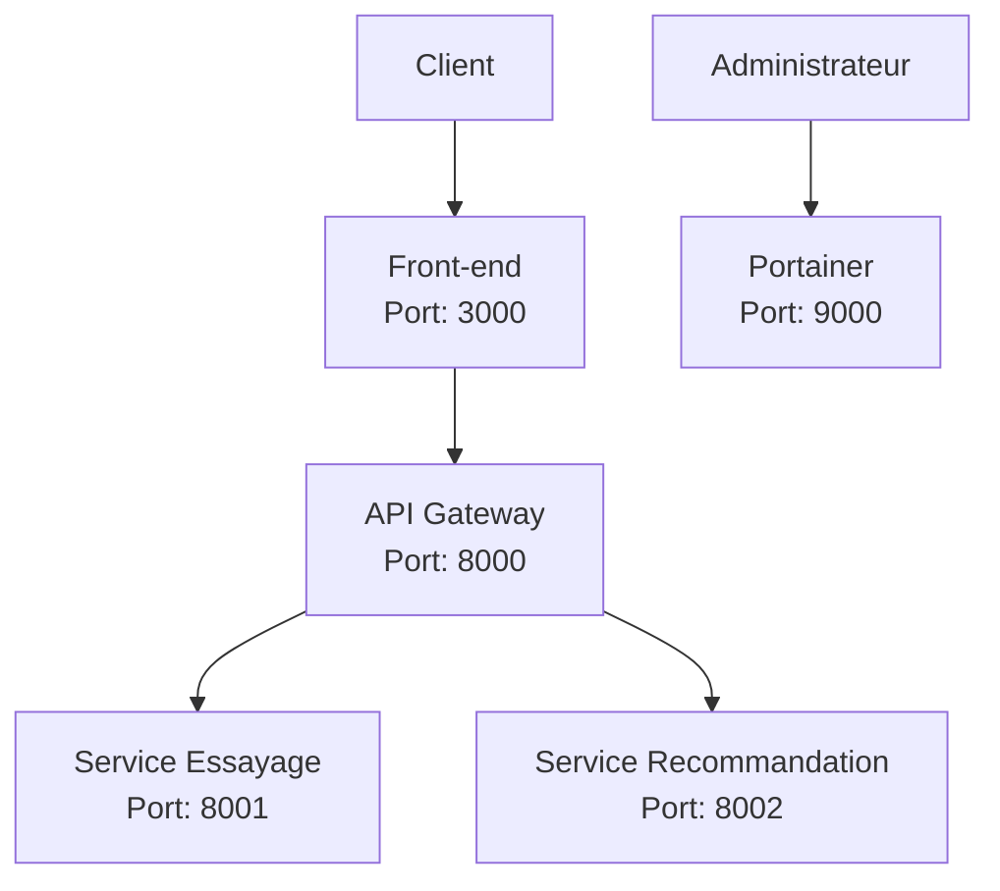
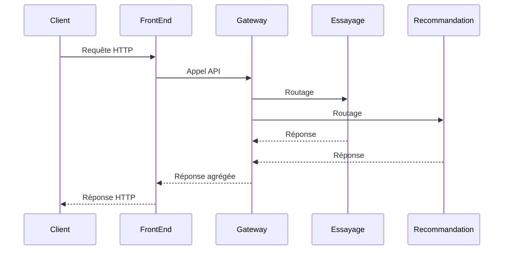

# Architecture du système

## Vue d'ensemble

Le système est une application distribuée basée sur une architecture microservices, composée des éléments suivants :

- Front-end (port 3000)
- API Gateway (port 8000)
- Service d'essayage (port 8001)
- Service de recommandation (port 8002)
- Portainer pour la gestion des conteneurs (port 9000)

## Diagramme d'architecture

## Composants principaux

### Front-end
- Interface utilisateur web
- Port d'exposition : 3000
- Communique avec l'API Gateway

### API Gateway
- Point d'entrée unique pour tous les services
- Port d'exposition : 8000
- Gère le routage des requêtes vers les services appropriés

### Service d'Essayage
- Service dédié aux fonctionnalités d'essayage de lunette
- Port d'exposition : 8001
- Expose une API REST

### Service de Recommandation
- Service de recommandation de lunette
- Port d'exposition : 8002
- Expose une API REST

### Portainer
- Interface de gestion des conteneurs Docker
- Port d'exposition : 9000
- Permet la surveillance et la gestion des services

## Infrastructure

Le système est conteneurisé avec Docker et orchestré via Docker Compose. Chaque service est exécuté dans son propre conteneur, permettant une isolation et une scalabilité indépendante.

### Configuration Docker
- Version de Docker Compose : 3.8
- Chaque service a son propre Dockerfile
- Les volumes sont utilisés pour la persistance des données
- Les ports sont exposés pour permettre la communication entre les services

## Communication entre les services

## Sécurité

- Les services communiquent via des ports dédiés
- L'API Gateway agit comme un point de contrôle central
- Portainer permet une gestion sécurisée des conteneurs 